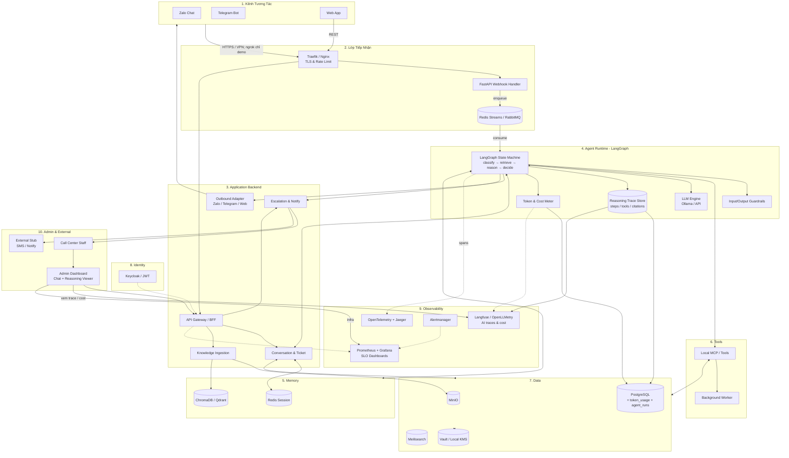

# Kiến Trúc Core — AI Conversational Operations Platform
*Nền tảng core dùng chung cho hackathon 48h: chưa gắn đề bài cụ thể. Domain (ngân hàng, y tế, giáo dục, PCTT, chính phủ…) gắn sau bằng **Domain Pack**. On-premise / air-gapped ready.*

## 1. Tổng Quan Vận Hành Hệ Thống

### 1.1. Hệ thống này là gì — Core, không phải một “đề”

Đây **không** phải sản phẩm cho một ngành cố định. Đây là **Core System**: nền tảng đối thoại vận hành (Conversational Operations Platform) để trong 48h, khi đề bài lộ diện, đội chỉ cần **swap Domain Pack** (tri thức + tools + playbook + copy UI) thay vì dựng lại hạ tầng.

Core làm những việc **mọi đề AI đều cần**:

| Năng lực core | Giá trị với gần như mọi track |
| :--- | :--- |
| Đa kênh (Web / Telegram / Zalo) + event chuẩn | User ở đâu cũng vào cùng pipeline |
| Ticket / hội thoại / escalate người thật | Vận hành thực, không chỉ demo chat |
| LangGraph agent + RAG + citations | AI-native, có kiểm chứng |
| Reasoning trace (`run_id`) | Giám khảo / ops thấy agent “nghĩ” gì |
| Token meter + cache + routing | Kiểm soát chi phí inference |
| Observability (infra + pipeline + AI) | Chạy được, đo được, pitch được |
| docker-compose 1-click + seam scale on-prem | Deploy nhanh; tầm nhìn doanh nghiệp |

**Domain Pack** (gắn *sau* khi có đề) chỉ gồm: seed docs, intents/playbooks, tool stubs chuyên ngành, prompt/policy, nhãn UI — **không đụng core**.

Ba vòng đời của core (domain-agnostic):

1. **Hot path:** tin nhắn vào → xử lý → trả lời / escalate.  
2. **Cold path:** admin nạp tài liệu → index → RAG.  
3. **Ops path:** staff nhận ticket, xem reasoning, can thiệp.

### 1.1bis. Tầng Core vs Domain Pack (cách “đấm” mọi đề trong 48h)

```text
┌─────────────────────────────────────────────────────────┐
│  DOMAIN PACK (swap theo đề bài — vài giờ)               │
│  knowledge/ · prompts/ · playbooks/ · tools_domain/     │
│  UI copy · stub APIs ngành · eval golden set            │
└───────────────────────────┬─────────────────────────────┘
                            │ mounts vào
┌───────────────────────────▼─────────────────────────────┐
│  CORE PLATFORM (chuẩn bị sẵn — bất biến theo đề)        │
│  channels · queue · backend · LangGraph · RAG engine    │
│  reasoning · tokens · obs · admin · compose deploy      │
└─────────────────────────────────────────────────────────┘
```

Ví dụ khi có đề: Ngân hàng → pack KYC FAQ + tool số dư stub; Y tế → pack triệu chứng triage + escalate bác sĩ; Giáo dục → pack lịch học + Q&A; PCTT → pack cứu hộ + SOS playbook. **Core giữ nguyên.**

### 1.2. Nguyên tắc thiết kế (non-negotiable)

| Nguyên tắc | Ý nghĩa vận hành |
| :--- | :--- |
| **Core ổn định, domain thay được** | Đề đổi → chỉ đổi pack; không rewrite platform. |
| **ACK trước, suy luận sau** | Zalo/Telegram không chờ LLM. Webhook 200 ngay; việc nặng vào Queue. |
| **AI quyết định nội dung, Backend quyết định side-effect** | Mọi ghi DB / gửi tin / ticket đi qua Application Backend — audit được. |
| **Một conversation, nhiều kênh** | Zalo / Telegram / Web → event chung + `conversation_id`. |
| **Bot có giới hạn có chủ đích** | Confidence thấp / cần người → escalate (lý do lấy từ policy + domain playbook). |
| **Tri thức nội bộ trước model** | RAG từ kho docs của pack; LLM suy luận trên ngữ cảnh đã nạp. |
| **Suy luận giải thích được** | Mỗi run gắn `run_id` + LangGraph steps + citations trên Admin. |
| **Chi phí inference có kiểm soát** | Meter token; semantic cache; model routing. |
| **Demo ≠ Production topology** | 48h monolith; target on-prem / air-gapped giữ đúng seam. |

### 1.3. Bản đồ thành phần — ai làm việc gì

Hệ thống chia **10 lớp core**. Domain Pack **không** thành lớp riêng trên diagram — nó cấu hình lớp 4 (prompts/tools), 5–7 (docs/embeddings), và copy lớp 10.

| # | Lớp | Thành phần chính | Trách nhiệm trong vận hành |
| :---: | :--- | :--- | :--- |
| 1 | **Kênh tương tác** | Zalo, **Telegram**, Web App | Điểm vào. Không chứa logic domain. |
| 2 | **Tiếp nhận (Ingestion)** | Traefik/Nginx, Webhook, Queue | TLS, rate-limit, chuẩn hóa, đệm tải. |
| 3 | **Application Backend** | BFF, Conversation/Ticket, Outbound, Escalation, Knowledge Ingestion | Thần kinh nghiệp vụ core. |
| 4 | **Agent Runtime** | **LangGraph**, Guardrails, LLM, Reasoning Store | Graph + RAG + tools; policy/prompt lấy từ Domain Pack. |
| 5 | **Memory** | Redis, Vector DB | Session + RAG index (nội dung pack). |
| 6 | **Tools** | MCP / plain tools + Worker | Core tools + `tools_domain` plugin. |
| 7 | **Data** | PostgreSQL, MinIO, Meilisearch, Vault | Business data + `agent_runs` / `token_usage`. |
| 8 | **Identity** | Keycloak / JWT | RBAC Admin / Staff. |
| 9 | **Observability** | Prometheus, Grafana, OTel, Jaeger, Langfuse, SLOs | Infra + pipeline + AI quality/cost. |
| 10 | **Admin & External** | Admin Dashboard, Staff console, External Stub | Điều khiển người + stub API (domain gắn stub riêng). |

### 1.4. Cách toàn hệ thống chạy (narration end-to-end)

**Vào biên giới.** Tin từ Zalo/Telegram/Web → Proxy (TLS, rate-limit) → Webhook (kênh) hoặc BFF (Web/Admin).

**Ghi nhận trước khi suy nghĩ.** Verify chữ ký kênh → event chuẩn → Conversation Service gán `conversation_id` → Postgres + Redis → Queue → `200 OK`.

**LangGraph trên hàng đợi.** `guard_in → classify → retrieve → reason → tools? → decide → guard_out`. Intent labels / playbook / tool list **đọc từ Domain Pack**. Mỗi node ghi Reasoning Store.

**Outbound cổng duy nhất.** Gửi đúng kênh; lưu message + citations + `run_id`.

**Escalate.** Staff xem hội thoại + “agent đã nghĩ gì”; trả lời cùng thread.

**Tri thức / chi phí / quan sát.** Cold path nạp docs của pack. Meter token mọi LLM call. Dashboard ops domain-agnostic.

### 1.5. Hai chế độ triển khai (cùng một kiến trúc)

| | **Ship / Demo 48h** | **Target On-Premise** |
| :--- | :--- | :--- |
| Compute | FastAPI monolith + Agent worker | Service tách lớp 3–6 trên K8s |
| Domain | 1 Domain Pack seed sẵn (sau khi biết đề) | Nhiều pack / tenant |
| Identity | JWT đơn giản | Keycloak + RBAC |
| Secrets | Env / file | Vault / Local KMS |
| Observability | Logs + reasoning JSON + token table + `/metrics` | Prometheus + Grafana + Jaeger + Langfuse |
| Kênh | Web + Telegram (+ Zalo nếu kịp) | Webhook chính thức / VPN |
| Expose | ngrok chỉ demo | Domain nội bộ — không tunnel công cộng |
| LLM | Ollama ($0 API token) | vLLM + router + cache |

### 1.6. Core loop phải chứng minh được (trước cả khi có đề)

```text
User hỏi trên Web hoặc Telegram
  → ACK + lưu ticket (core)
  → LangGraph + RAG (docs pack tối thiểu / sample)
       → trả lời + citation + reasoning trace
       → hoặc escalate
  → Staff thấy chat + cách agent suy nghĩ + token
  → Staff reply cùng kênh
```

Khi đề lộ: thay `data/knowledge/` + `playbooks/` + vài tool — **core loop không đổi**.

### 1.7. Tầm nhìn core còn mở rộng gì? (không gắn đề)

Đây là backlog **nâng cấp nền**, không phải checklist làm trước giờ đề:

| Hướng mở rộng core | Vì sao hữu ích đa đề | Gợi ý |
| :--- | :--- | :--- |
| **Domain Pack SDK** | Chuẩn hoá cách “cắm” đề mới trong vài giờ | Manifest YAML: intents, tools, prompts, seed paths |
| **Smart deploy / GitOps** | Nâng từ compose → upgrade/rollback doanh nghiệp | Helm + Argo CD + env profiles |
| **Eval harness** | Mọi pack có golden Q&A riêng, gate chung | ragas/eval job + scoreboard |
| **Feedback loop** | Staff sửa → dataset/prompt patch cho mọi ngành | Thumb + export |
| **Multimodal slot** | Ảnh/file đính kèm vào cùng event (y tế, PCTT, BH…) | Attachment → caption/OCR node trong graph |
| **Edge / store-and-forward** | Môi trường mạng kém (nông thôn, hiện trường) | Cache FAQ + sync lại |
| **SLO + runbook template** | Vận hành chuyên nghiệp, copy cho mọi customer | p95 reply, escalate rate, burn alerts |
| **Multi-tenant** | Nhiều đơn vị / nhiều pack trên một cluster | `tenant_id` + RBAC |
| **Compliance export** | Audit theo `conversation_id` + `run_id` | PDF/JSON export |

---

## 2. Sơ Đồ Kiến Trúc



---

## 3. Các Thành Phần Công Nghệ (Tech Stack)

| Lớp (Layer) | Giải pháp Open-Source | Vai trò trong hệ thống |
| :--- | :--- | :--- |
| **Ingestion (Gateway)** | **Traefik / Nginx** | Reverse Proxy, Rate-limiting, TLS. |
| **Ingestion (Webhook)** | **FastAPI** | Nhận payload Zalo/Telegram, verify, trả 200 OK ngay. |
| **Message Queue** | **Redis Streams / RabbitMQ** | Đệm tin nhắn, chống mất khi spike. |
| **API Gateway / BFF** | **FastAPI REST** | API Web & Admin; không cho UI đụng thẳng DB. |
| **Conversation & Ticket** | **FastAPI + PostgreSQL** | Session, lịch sử, ticket, escalate. |
| **Knowledge Ingestion** | **Python Worker + Embeddings** | Upload → chunk → embed → Vector DB. |
| **Channel Outbound** | **Channel Adapter** | Gửi tin Zalo / **Telegram** / Web. |
| **Escalation & Notify** | **Service + Queue** | Handoff Call Center; stub SMS/notify. |
| **Agent Runtime** | **LangGraph** (+ LangChain tools) | State machine suy luận có kiểm soát; không ReAct “tự do vô định”. |
| **AI Security** | **NeMo Guardrails** / policy nhẹ | Input/output filter, chống prompt injection. |
| **Reasoning Trace** | **Postgres `agent_runs` + Langfuse** | Lưu từng bước graph; Admin xem “agent nghĩ gì”. |
| **Cost Meter** | **token_usage table + meter middleware** | Đếm token/latency/model; báo cáo chi phí. |
| **Tool Gateway** | **Local MCP / plain tools** | Tools chuẩn hóa; MVP có thể plain functions. |
| **Memory (Short-term)** | **Redis** | Session hội thoại. |
| **Memory (Long-term)** | **ChromaDB / Qdrant** | RAG embeddings. |
| **Object Storage** | **MinIO** | File gốc tài liệu. |
| **Search Engine** | **Meilisearch / Typesense** | Full-text khẩn (optional MVP). |
| **Relational DB** | **PostgreSQL** | Business + runs + token usage. |
| **Secrets** | **Vault / Local KMS** | Mã hoá at-rest / secrets. |
| **Identity** | **Keycloak / JWT** | RBAC Admin/Staff. |
| **Obs Metrics** | **Prometheus + Grafana** | Infra + SLO + queue depth + escalate rate. |
| **Obs Tracing** | **OpenTelemetry + Jaeger** | Trace request xuyên service. |
| **Obs LLM** | **Langfuse hoặc OpenLLMetry** | Trace LLM/tool/node LangGraph + cost. |
| **Alerting** | **Alertmanager** | Cảnh báo chậm, lỗi, cháy token, queue đầy. |

---

## 4. Backend Hoạt Động Như Thế Nào

Backend = **Lớp 3** — nhận request, lưu trạng thái, đẩy việc cho Agent, gửi tin / escalate / nạp tri thức. **Không thay LLM suy luận.**

MVP: gộp một FastAPI process; target: tách service, API giữ nguyên.

### 4.1. Vai trò từng thành phần

| Module | Nhận gì | Làm gì | Ghi / gọi đâu |
| :--- | :--- | :--- | :--- |
| **BFF** | REST Web/Admin (JWT) | Route, authz, validate | → Conv / Knowledge / Escalate |
| **Webhook** | POST Zalo / Telegram | Verify, normalize, `200 OK` | → Queue + ConvSvc |
| **Conversation & Ticket** | Event / lệnh agent | `conversation_id`, message, ticket status | Postgres + Redis |
| **Outbound** | `{channel, user_id, text}` | Gửi Zalo OA / Telegram Bot API / Web SSE | Channel API |
| **Escalation** | Lý do + conversation | Ticket escalated + notify | Postgres + Admin + Stub |
| **Knowledge Ingestion** | File Admin | Chunk → embed → index | MinIO + Vector DB |
| **LangGraph Agent** | Event từ Queue | Graph suy luận + RAG + decide | Memory, Tools, Outbound, ReasonStore, CostMeter |

### 4.2. Event model chung

```json
{
  "event_id": "uuid",
  "channel": "zalo|telegram|web",
  "external_user_id": "string",
  "conversation_id": "uuid|null",
  "text": "Đường đang ngập ở đâu gần Cầu Giấy?",
  "attachments": [],
  "received_at": "ISO-8601"
}
```

### 4.3–4.5. Luồng chính (tóm tắt)

- **A Chat:** Channel → Proxy → Webhook/BFF → ConvSvc → Queue → **LangGraph** → Outbound → lưu message + `run_id`.
- **B Escalate:** Graph quyết định ESCALATE → ticket → Admin (xem luôn reasoning) → Staff reply qua Outbound.
- **C Knowledge:** Admin upload → ingest nền → Agent chỉ query index lúc chat.

### 4.6. API bề mặt chính

| Nhóm | Endpoint (ví dụ) | Ai gọi |
| :--- | :--- | :--- |
| Channel | `POST /webhooks/zalo`, `POST /webhooks/telegram` | Nhà mạng / Telegram |
| Chat | `POST /api/chat/messages`, `GET /api/chat/{id}` | Web |
| Conversations | `GET /api/conversations`, `GET /api/conversations/{id}` | Admin |
| Tickets | `POST .../escalate`, `POST .../reply`, `PATCH .../close` | Agent / Staff |
| Reasoning | `GET /api/runs/{run_id}`, `GET /api/conversations/{id}/runs` | Admin (xem suy nghĩ) |
| Cost | `GET /api/metrics/tokens?from=&to=` | Admin / Finance ops |
| Knowledge | `POST /api/knowledge/upload`, `GET /api/knowledge` | Admin |
| Health | `GET /health`, `GET /ready` | Proxy / Prometheus |

### 4.7. Ranh giới Backend vs Agent

- **Backend:** auth, persistence, queue, idempotency, outbound, ticket, lưu run/token.
- **Agent (LangGraph):** hiểu câu, retrieve, tool, soạn trả lời, quyết định escalate, emit trace.
- **Cấm Agent:** ghi DB lung tung, gọi thẳng Telegram/Zalo API.

---

## 5. LangGraph Agent — Tư Duy Như Thế Nào (Reasoning Transparency)

Đây là điểm pitch **AI-Native có kiểm chứng**: giám khảo / Call Center không chỉ thấy câu trả lời, mà thấy **chuỗi quyết định**.

### 5.1. State machine (graph)

```text
START
  → guard_input          # chặn injection / spam
  → classify_intent      # intents từ Domain Pack (FAQ | need_human | task | unknown…)
  → retrieve_rag         # top-k chunks + scores (docs của pack)
  → reason               # LLM + citations khi trả lời dựa trên tri thức
  → tools?               # core tools + tools_domain (plugin theo đề)
  → decide               # REPLY | ESCALATE | CLARIFY
  → guard_output         # policy chung + policy pack
  → END (emit AgentResult)
```

Mỗi node = 1 bước suy nghĩ có tên, input/output JSON, latency_ms, token_usage (nếu gọi LLM).

### 5.2. AgentResult (contract)

```json
{
  "run_id": "uuid",
  "decision": "REPLY|ESCALATE|CLARIFY",
  "answer": "string|null",
  "citations": [{"doc_id": "...", "title": "...", "score": 0.82}],
  "confidence": 0.0,
  "escalate_reason": "low_confidence|need_human|policy|null",
  "steps": [
    {"node": "classify_intent", "output": {"intent": "faq"}, "latency_ms": 40},
    {"node": "retrieve_rag", "output": {"hits": 3}, "latency_ms": 25},
    {"node": "reason", "output": {"draft_len": 180}, "tokens_in": 1200, "tokens_out": 220}
  ],
  "model_id": "qwen2.5:14b",
  "total_tokens_in": 1200,
  "total_tokens_out": 220,
  "total_latency_ms": 1800
}
```

### 5.3. Hiển thị trên Admin (Reasoning Viewer)

- Timeline node LangGraph (đúng thứ tự).
- Chunk RAG đã chọn + score (vàng/đỏ nếu score thấp → giải thích vì sao escalate).
- Tool calls (tên, args, kết quả stub/thật).
- Quyết định cuối + reason code.
- Nút “dùng trace này để trả lời / phủ quyết”.

**Pitch một câu:** *Agent không phải hộp đen — mỗi câu trả lời gắn black-box-opened graph + nguồn.*

### 5.4. Persist

- Bảng `agent_runs` (Postgres): full JSON steps.
- Optional đẩy mirror sang **Langfuse** cho filter theo model/latency/cost.
- Message assistant lưu `run_id` FK.

---

## 6. Chi Phí Token & Kinh Tế Inference

### 6.1. Nguồn chi phí

| Nguồn | Demo 48h (Ollama local) | Production API cloud | Production on-prem GPU |
| :--- | :--- | :--- | :--- |
| LLM generate | **~$0** (điện/GPU máy) | $ theo token | Khấu hao GPU + điện |
| Embedding | **~$0** local | $ theo token | Local encode |
| License stack | **$0** OSS | $0 OSS | $0 OSS (+ hỗ trợ vendor nếu mua) |
| Telegram Bot API | **$0** | $0 | $0 |
| Zalo OA | Tuỳ gói OA | Tuỳ hợp đồng | Tuỳ hợp đồng |
| Observability SaaS | Self-host Langfuse = $0 | Cloud Langfuse/Phoenix có thể trả | Self-host |

### 6.2. Cơ chế kiểm soát chi phí (bắt buộc có trong kiến trúc)

1. **Semantic cache (Redis):** câu hỏi gần giống → trả cache, **0 token**.
2. **Model routing:** intent đơn giản → model nhẹ; SOS/phức tạp → model nặng.
3. **Context budget:** giới hạn top-k + max chars lịch sử; truncate có chủ đích.
4. **Tool trước LLM khi đủ:** lookup hotline deterministic không cần generate dài.
5. **Hard cap / budget:** `MAX_TOKENS_PER_CONV_DAY`, reject hoặc escalate khi vượt.
6. **Meter mọi call:** middleware ghi `tokens_in/out`, `estimated_usd` (bảng giá cấu hình được; local = 0).

### 6.3. Công thức báo cáo (Admin / slide)

```text
Cost_period ≈ Σ (tokens_in × p_in + tokens_out × p_out)  // cloud
            ≈ Σ GPU_seconds × rate                       // on-prem nội bộ
Cache_hit_rate, Avg_tokens_per_reply, Cost_per_resolved_ticket
```

Dashboard tối thiểu: **tokens/ngày**, **cache hit %**, **cost ước tính**, **token theo intent**, **top conversation đốt token**.

### 6.4. Chiến lược pitch tài chính

- Demo: **air-gapped + Ollama = không phụ thuộc hoá đơn OpenAI**.
- Scale: vẫn đo token **như thể** trả phí — CTO thấy biết quản trị trước khi gắn API đắt hoặc cluster GPU.

---

## 7. Observability & Monitoring (chuẩn vận hành)

Không chỉ “có Grafana”. Theo dõi **3 mặt phẳng**: Infra · Pipeline · AI Quality/Cost.

### 7.1. Ba mặt phẳng

| Mặt phẳng | Thu thập gì | Tool |
| :--- | :--- | :--- |
| **Infra** | CPU/RAM/GPU, disk, container health | Prometheus + Grafana + node exporter |
| **Pipeline** | RPS webhook, queue depth, ACK latency, outbound fail, escalate rate | Prometheus metrics từ API/worker + Jaeger traces |
| **AI** | Node latency LangGraph, retrieval score, confidence, token, cache hit, hallucination flags | Langfuse / OpenLLMetry + `agent_runs` |

### 7.2. Metrics bắt buộc (Red / USE / AI)

- `http_request_duration_seconds` (webhook, BFF)
- `queue_depth`, `queue_lag_seconds`
- `agent_run_duration_seconds` (theo node)
- `agent_decision_total{decision=reply\|escalate\|clarify}`
- `rag_top_score`, `rag_hit_count`
- `llm_tokens_total{direction=in\|out,model=...}`
- `llm_cache_hit_total`
- `outbound_errors_total{channel=...}`
- `tickets_open`, `tickets_escalated`

### 7.3. Trace correlation

```text
trace_id (OTel)
  └─ webhook span
  └─ enqueue span
  └─ langgraph run span (run_id)
        ├─ classify
        ├─ retrieve
        ├─ reason (LLM gen)
        └─ decide
  └─ outbound span
```

Admin mở conversation → click `run_id` → nhảy Langfuse/Jaeger **cùng correlation id**.

### 7.4. SLO gợi ý (ghi vào runbook)

| SLO | Mục tiêu demo / prod (ví dụ) |
| :--- | :--- |
| Webhook ACK | p99 < 200ms |
| Time-to-first-reply (không SOS) | p95 < 8s (local LLM) |
| Escalate đúng SOS | > 95% trên golden set |
| Outbound success | > 99% |
| Error budget | Alert khi burn rate cao |

### 7.5. Alert

- Queue depth > N trong 2 phút  
- LLM error rate > X%  
- Token burn > budget/ngày  
- Không có reply + không escalate sau T giây (message “treo”)  
- Disk vector/Postgres > 85%

### 7.6. Demo 48h tối thiểu (vẫn “tốt đủ pitch”)

- Structured JSON logs có `trace_id`, `run_id`, `conversation_id`
- Bảng `agent_runs` + UI Reasoning Viewer
- Bảng/API `token_usage`
- `/metrics` Prometheus + 1 Grafana dashboard import sẵn  
- Jaeger/Langfuse: optional nếu còn giờ — interface đã để sẵn

---

## 8. Luồng Hoạt Động Tổng (End-to-End)

1. **Tiếp nhận:** Zalo / Telegram / Web → Proxy → Webhook hoặc BFF.  
2. **Đệm:** Normalize event → ConvSvc lưu → Queue → `200 OK`.  
3. **LangGraph:** Guard → classify → RAG → reason/tools → decide.  
4. **Ghi suy luận + token:** `agent_runs` + Cost Meter.  
5. **Outbound / Escalate:** gửi kênh hoặc handoff; Admin xem trace.  
6. **Knowledge cold path:** upload → embed ngoài hot path.  
7. **Obs:** metrics / traces / alerts / cost dashboard theo thời gian thực.

---

## 9. Ghi Chú Triển Khai (48h — Core trước, đề sau)

- **Chuẩn bị trước giờ đề:** ship **Core** (compose + LangGraph + RAG engine + Admin reasoning/cost + Web/Telegram). Seed **sample Domain Pack** generic (FAQ demo) để core loop luôn chạy được.
- **Sau khi BTC công bố đề:** chỉ tạo/đổi Domain Pack (docs, playbooks, tools stub, prompt) — không dựng lại kiến trúc.
- **1-Click:** `docker compose up -d`. Không K8s trong demo.
- **Monolith OK:** BFF + Conv + Outbound + Escalate + LangGraph worker.
- **Kênh:** Web + Telegram ưu tiên; Zalo optional. **Không WhatsApp.**
- **LLM:** Ollama mặc định. Reasoning Viewer + token meter **bắt buộc** trong Admin.
- **ngrok:** chỉ demo tunnel.
- **Pitch lõi:** *Core platform AI-native, audit được, đo cost được, gắn domain pack theo đề — không phải chatbot một ngành.*

---

## 10. Hướng Mở Rộng Trưởng Thành (On-Premise Scaling)

### Giai đoạn 1 — Data Tier
PostgreSQL HA (Patroni), MinIO distributed, Redis Cluster/Sentinel.

### Giai đoạn 2 — Compute Tier
K8s on-prem (RKE2/K3s) + **KEDA** scale Agent theo queue; GitOps (Argo CD) smart deploy; multi-tenant + nhiều Domain Pack.

### Giai đoạn 3 — LLMOps
Semantic cache, **vLLM/Triton**, model router, eval harness theo pack, versioning graph/prompt.

### Giai đoạn 4 — Multi-site
2 DC Active-Active, Kafka/Debezium — liên tục vận hành khi một site sập (áp dụng được government / enterprise, không gắn một ngành).
