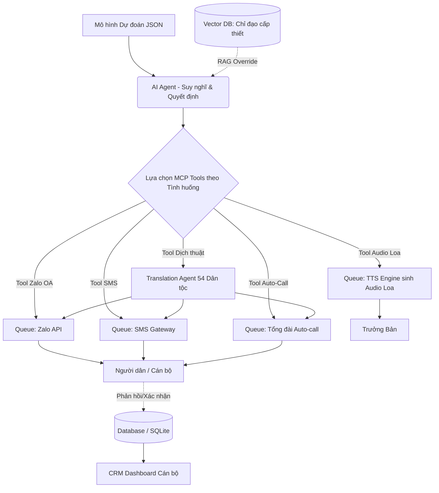

# TÀI LIỆU ĐẶC TẢ SẢN PHẨM (PRD)

**MODULE OUTPUT: CRM Quản lý cho Cán bộ & Hệ thống AI Gửi thông báo tự động**
**Dự án:** Hệ thống Cảnh báo Thời tiết Thông minh tỉnh Điện Biên (DBWAS-2025)

| Mã module | Phiên bản | Ngày cập nhật | Trạng thái |
| :--- | :--- | :--- | :--- |
| `DBWAS-OUTPUT-001` | 1.3 (Final Locked) | 17/07/2026 | Đã chốt (Locked) |

---

## 1. Tổng quan Module Output

### 1.1. Mục đích
Module Output là tầng phân phối cuối cùng của hệ thống DBWAS. Hệ thống đóng vai trò "hệ thần kinh phản xạ sinh tồn" (Zero-latency survival action), chịu trách nhiệm đưa thông tin cảnh báo thời tiết cực đoan đến đúng người, đúng kênh, đúng ngôn ngữ.

> [!IMPORTANT]
> Mục tiêu cốt lõi không phải là gửi bản tin dự báo thời tiết vô hồn, mà là **chuyển hóa dữ liệu thời tiết thành các mệnh lệnh hành động tức thời** cho đồng bào vùng cao, đặc biệt là nhóm người yếu thế (không có smartphone, rào cản ngôn ngữ).

### 1.2. Đối tượng sử dụng

| Đối tượng | Thành phần hệ thống | Hành động cốt lõi |
| :--- | :--- | :--- |
| **Cán bộ tỉnh/huyện** | CRM Dashboard | Giám sát toàn cảnh bản đồ tỉnh, tỷ lệ tin nhắn. Upload văn bản chỉ đạo khẩn cấp (RAG). |
| **Cán bộ xã** | CRM Dashboard + Notif | Xem chi tiết xã, nhận SMS/Zalo, theo dõi trạng thái trưởng bản đã nhận tin chưa. |
| **Trưởng bản** | SMS/Zalo/Gọi + Audio Loa | Nhận cảnh báo + File Audio MP3 để phát trên hệ thống loa phát thanh của bản. |
| **Người dân** | SMS/Zalo/Cuộc gọi tự động | Nhận cảnh báo trực tiếp. Người không biết chữ sẽ nhận **cuộc gọi tự động bằng tiếng dân tộc thiểu số**. |

---

## 2. Kiến trúc Hệ thống (Hybrid Modular Worker & RAG Agentic Workflow)

Hệ thống sử dụng kiến trúc **Modular Worker** (FastAPI + Celery/Redis) tích hợp luồng xử lý AI (Agentic Workflow) và **RAG (Retrieval-Augmented Generation)** để đảm bảo tuân thủ các quyết định hành chính mới nhất.

---

## 3. Hệ thống RAG Quản lý Chỉ đạo Khẩn cấp (Highest Priority)

Để đảm bảo hệ thống không chỉ hành động dựa trên AI dự đoán mà còn tuân thủ tuyệt đối các mệnh lệnh hành chính (Chính sách, Hướng dẫn, Thông tư, Quyết định khẩn cấp), hệ thống tích hợp phân hệ **RAG Policy Engine**.

### 3.1. Nhập liệu Văn bản Chỉ đạo
* Cán bộ sử dụng CRM Dashboard để **import các file văn bản cấp thiết** (PDF, Word, Text) vào hệ thống Vector DB.
* Mỗi văn bản bắt buộc đi kèm **Ngày bắt đầu** và **Ngày kết thúc hiệu lực**. 
* *Trường hợp xấu nhất (Cán bộ quên nhập hạn):* Hệ thống mặc định giới hạn hiệu lực tối đa là **2 tháng** để tránh áp dụng các quy định lỗi thời.

### 3.2. Cơ chế RAG Override (Thực thi quyền cao nhất)
* Sau khi nhận kết quả dự báo thời tiết, **TRƯỚC KHI** đưa ra quyết định phân phối, AI Agent phải thực hiện bước kiểm tra (RAG query) vào kho Văn bản Chỉ đạo còn hiệu lực.
* Nếu AI tìm thấy một chỉ đạo hành động rõ ràng tương ứng với hình thái thời tiết hiện tại (Ví dụ: "Công điện khẩn 04/CĐ yêu cầu sơ tán toàn bộ dân sát bờ sông Nậm Rốm khi mưa lũ"), LLM sẽ **ưu tiên dùng thông tin trong văn bản đó để đưa ra quyết định hành động**. Quyết định từ văn bản này sẽ ghi đè (override) các kịch bản mặc định của AI.

---

## 4. Hệ thống AI Phân phối Đa kênh & Đa ngôn ngữ (54 Dân tộc)

### 4.1. Cơ chế Định nghĩa Ngôn ngữ (54 Dân tộc)
Hệ thống quản lý thông tin cư dân với trường dữ liệu `ethnic_group` (khớp với 54 dân tộc Việt Nam). Khi Agent nhận tín hiệu:
1. Truy vấn danh sách người dân trong vùng bị ảnh hưởng, gom nhóm theo dân tộc.
2. Dùng MCP Tool Dịch thuật để dịch sang ngôn ngữ dân tộc tương ứng.
3. **Fallback:** Nếu một dân tộc chưa có bộ ngôn ngữ hỗ trợ chuẩn, hệ thống tự động fallback về tiếng Kinh nhưng sử dụng từ ngữ mệnh lệnh cực kỳ đơn giản.

| Vai trò | Kênh Zalo (Rich Text) | Kênh SMS (GSM-7) | Cuộc gọi Tự động | Audio Loa Phát thanh |
| :--- | :--- | :--- | :--- | :--- |
| **54 Dân tộc** | Text được dịch | SMS không dấu theo dân tộc | **Audio tiếng dân tộc** | - |
| **Trưởng Bản** | Có + File Audio MP3 | Có + Link tải MP3 | Có (Hướng dẫn) | **Có (File âm thanh)** |

### 4.2. Cấu trúc Chuẩn hóa Bản tin
> [!TIP]
> Bản tin chuyển thành **mệnh lệnh hành động** (hoặc nội dung RAG chỉ đạo).
* **Mở đầu:** Tag cảnh báo (VD: `[CANH BAO CAM]`)
* **Loại rủi ro & Thời gian:** `Mua to tai Tua Chua toi nay.`
* **Hành động (Ưu tiên RAG):** `Di doi theo Cong dien 04.`
* **Xác nhận (nếu có):** `Tra loi 1=Da nhan.`

### 4.3. Các kênh truyền thông chi tiết
1. **Zalo OA & SMS:** Như đã định nghĩa.
2. **Auto-Call (Tổng đài):**
   * **Âm thanh mở đầu:** Ghi âm sẵn tùy theo hình thái báo động (VD: Tiếng sạt lở đá cho sạt lở, còi hụ bão cho giông lốc).
   * **Nội dung:** Đọc thông báo bằng TTS hoặc file thu âm sẵn tiếng dân tộc.

---

## 5. Giao diện CRM Dashboard (Cán bộ)

### 5.1. Bản đồ Tương tác Đa lớp (Zoomable Interactive Map)
Bản đồ cho phép **Zoom in/Zoom out** đa cấp (Tỉnh -> Huyện -> Xã -> Bản). Bản đồ hiển thị rõ:
* **Vị trí Thôn/Bản cụ thể.**
* **Pinpoint (Đánh dấu người dân thất lạc):** Nếu người dân chưa đọc Zalo hoặc không bắt máy, vị trí của họ hiện **dấu chấm đỏ** để cán bộ trực quan đánh giá và cử lực lượng cứu hộ tới tọa độ đó.

**Danh mục Icon Hình thái cực đoan:** 🌪️ Giông tố lốc gió giật | 🌀 Áp thấp nhiệt đới | 🌊 Ngập/Lũ ống/Lũ quét/Lũ bất thường/Lũ lịch sử/Lũ đặc biệt lớn/Sóng thần | 💨 Gió mạnh | ⚡ Sét | 🧊 Mưa đá | ❄️ Sương giá/Rét đậm/Rét hại/Sương muối | 🌫️ Sương mù | 🏜️ Hạn hán/Nắng nóng | 🔥 Cháy rừng | ⛰️ Sụt lún/Sạt lở đất | 🏚️ Động đất | 💧 Xâm nhập mặn.

### 5.2. Màn hình Chi tiết & Hành động
* **Thống kê chi tiết quân số:** Cung cấp con số cụ thể (VD: Xã A có tổng 1,500 dân, đã nhận 1,200 người, chưa nhận 300 người).
* **Hành động (Quick Actions):** Nút **[Gửi lại SMS]** hoặc **[Gọi khẩn cấp]** thẳng đến Trưởng bản thôn bị mất liên lạc.

---

## 6. Đặc tả API cốt lõi

| Method | Endpoint | Quyền hạn | Mục đích |
| :--- | :--- | :--- | :--- |
| `POST` | `/api/policy/upload` | Cán bộ Tỉnh | Upload văn bản chỉ đạo khẩn, trích xuất Vector embeddings. |
| `GET` | `/api/dashboard/map-data` | Cán bộ | Lấy tọa độ, mã màu và icon rủi ro cho toàn bộ Xã. |
| `GET` | `/api/communes/{id}/detail` | Cán bộ | Lấy danh sách thôn bản, log gửi tin và tỷ lệ phản hồi. |

---

## 7. Yêu cầu Phi chức năng (NFR)

> [!CAUTION]
> **Giải thích về Uptime và Latency "sinh tử":**
> Trong thảm họa, người dân chỉ có từ 1-5 phút để chạy lên đồi cao. Nếu hệ thống chậm trễ (Latency > 1 phút) hoặc sập nguồn (Uptime không đạt 99.99%), hệ thống sẽ trở nên vô giá trị và đe dọa sinh mạng. Mọi kiến trúc phải lấy sự bền bỉ làm cốt lõi.

* **NFR-01 (Độ trễ):** Thời gian từ khi AI chốt cảnh báo đến khi tin nhắn đầu tiên rời hệ thống phải **< 60 giây**.
* **NFR-02 (Throughput):** Worker Queue tối ưu chịu tải bắn **100.000 requests/giờ**.
* **NFR-03 (Fallback/Resilience bằng Dynamic Cache):** Nếu dịch vụ LLM sinh text bị timeout (> 2s), truy xuất **Dynamic Fallback Cache** lấy lại chính đoạn text AI đã sinh thành công cho trường hợp tương tự trước đó để gửi đi, tránh hardcode.
* **NFR-04 (Hands-free Real-time UI):** Cán bộ chỉ cần bật màn hình lớn trên tường, không cần F5 mà vẫn xem monitor liên tục qua Webhook/Websocket.

---

## 8. Lộ trình Triển khai (MVP cho Hackathon)

* **Phase 1 (Core - MVP):** 
  * Giả lập Model Dự báo Thời tiết (sử dụng `output_model_sample.json`).
  * Hệ thống Upload Văn bản RAG (Giới hạn hiệu lực).
  * AI Agent phân tích JSON, RAG văn bản, tự suy nghĩ đưa ra quyết định gọi **MCP Tool** tương ứng với hình thái thời tiết. Tích hợp Tool Dịch thuật.
  * Tích hợp xử lý Python (FastAPI/SQLite), Bản đồ Web hiển thị điểm dân chưa phản hồi.
* **Phase 2 (Localization & Scale):** Tích hợp TTS tiếng dân tộc. Tích hợp Celery/Redis Queue.
* **Phase 3 (Reporting):** Hệ thống Report PDF & Thống kê nâng cao.
